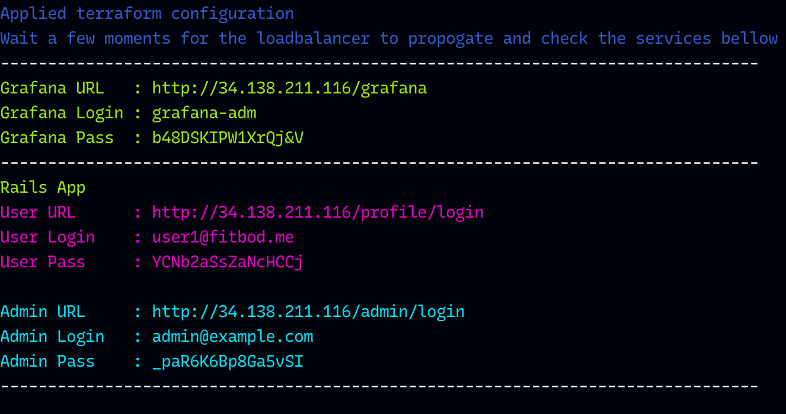
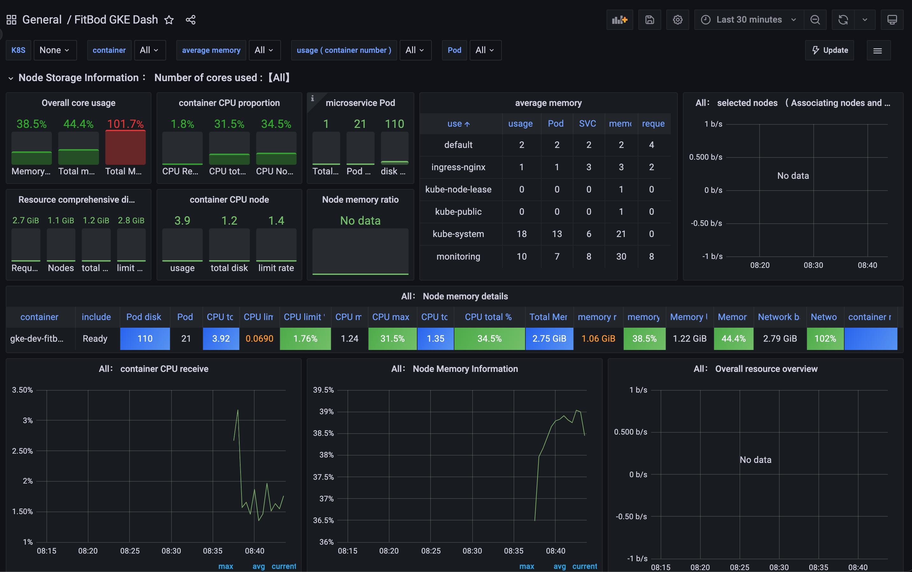

<!-- BEGIN_TF_DOCS -->
# Fitbod DevOps Skill Assesment

[](https://github.com/RichardLitt/standard-readme)

This repository contains the Terraform infrastructure needed to deploy and configure Fitbod's sample "myworkout" app.

## Table of Contents
- [Design Principles](#design-principles)
  * [Architecture](#architecture)
- [Prerequisites](#prerequisites)
- [Requirements](#requirements)
- [Initial setup](#initial-setup)
- [Deployment](#deployment)
  * [Automatic (recommended)](#automatic-recommended)
  * [Manual](#manual)
- [Testing](#testing)
- [Screenshots](#screenshots)
  * [Sample output of `run.sh` deployment script](#sample-output-of-runsh-deployment-script)
  * [Grafana Dashboard](#grafana-dashboard)
- [Terraform Modules](#modules)
  * [Providers](MODULES.md#providers)
  * [Resources](MODULES.md#resources)
  * [Inputs](MODULES.md#inputs)
  * [Outputs](MODULES.md#outputs)

## Design Principles

-	**Automation**: Utilize [Terraform](https://www.terraform.io/docs/providers/google/index.html) as the main automation framework, along with custom scripts to handle deployment with little need for user interaction.

-   **Scalability**: Infrastructure code for Kubernetes is designed around Google's Kubernetes Engine (GKE) and automatically scales with the use of Google's [autoscaler](https://cloud.google.com/compute/docs/autoscaler/)

-   **Managed Services**: For scalability, and SLA the application uses Google's CloudSQL service to manage PostgreSQL. Since databases are critical for an organizations business operations this should be pushed to managed service, which adds the added benefit of maintaining backups, scalability, and RBACs easily by means of APIs.

-   **Security**:
	- **Sensitive information**: Passwords for all application and services are generated and stored in a k8s secret managed service. This follows the principles that sensitive information shouldn't be stored in cleartext.
	- **Networking**: All pods, and services in the cluster utilize a **VPC** (virtual private connection) for communication. With the exception of ingress-controller, no services are exposed to external traffic. Furthermore, to better isolate, pods and services operate on different subnets, and namespaces.
		
## Architecture

The project is structured as follows.

```css
├── run.sh				(deployment script, use ./run.sh -h for usage)
├── app.tf
├── config
│   ├── grafana
│   │   └── dashboards
│   │       └── fitbod-k8s.json
│   ├── secrets
│   │   └── master.key			(rails masterkey)
│   ├── tfvars
│   │   ├── dev.tfvars			(environment file for 'dev')
│   │   ├── prod.tfvars			(environment file for 'prod')
│   │   └── terraform.tfvars		(required if manually deploying and an environment file)
│   └── values
│       ├── ingress.yaml
│       └── monitoring.yaml
├── db.tf
├── gke.tf
├── ingress.tf
├── main.tf
├── monitoring.tf
├── network.tf
├── outputs.tf
├── providers.tf
├── storage.tf
└── variables.tf
```

## Prerequisites

It's assumed the end user has a Google Cloud Platform account with an **existing** project.

## Requirements

- [terraform](https://www.terraform.io/downloads.html)
- [gcloud](https://cloud.google.com/sdk/gcloud/)
- [kubectl](https://kubernetes.io/docs/tasks/tools/install-kubectl/)
- [jq](https://stedolan.github.io/jq/download/) (json cli tool used to run testing script)
- bash (to run deployment script)
- Linux/Unix/MacOS (deployment script was not tested on Windows, but should work)

## Initial setup

Install necessary `gcloud` components. `gke-gcloud-auth-plugin` as of GKE 1.24 is required to handle authentication for kubectl.

```css
gcloud components install gke-gcloud-auth-plugin kubectl
```

Login

```css
gcloud auth application-default login
```

Initialize dependancies

```css
git clone https://github.com/qosmio/Fitbod fitbod
cd fitbod
terraform init -upgrade
```

### Configuration Setup

A valid `project_id` must be provided which points to an existing project on GCP. Update the config file `config/tfvars/terraform.tf` acordingly.

```hcl   
project_id             = "<PROJECT ID"
```

Further environment configuration like region/zone/machine types can be updated in the `config/tfvars/dev.tf` file
```hcl

db_availability_type   = "ZONAL"
gcp_zones              = ["us-east1-d"]
```

## Deployment

### Automatic (recommended)

**This will output URLs, usernames, and passwords required for user verifications. It will also take care of properly destroying the environment as Terraform is not able to perfectly resolve the order dependancies need to be torn down.**

- Create (apply) `dev` environment
```css
bash run.sh -a -e dev
```

- Destroy `dev` environment
```css
bash run.sh -d -e dev
```

### Manual

To manually deploy using terraform, you must supply the main `terraform.tfvars` file and a corresponding environment file. `prod.tfvars` or `dev.tfvars`. It's recommended to stick with `dev.tfvars` since prod version is heavier on resources.

```css
terraform apply -var-file config/tfvars/terraform.tfvars -var-file config/tfvars/dev.tfvars
```
## Testing

```css
bash scripts/test_api.sh
```

## Screenshots

### Sample output of `run.sh` deployment script


### Grafana Dashboard
Check the output from `run.sh` to find the url as well as the username and login. You shouldn't have to search for the dashboard. It's been setup to default on login.



## Modules
[**Complete README of Terraform Modules**](MODULES.md)
<!-- END_TF_DOCS -->
